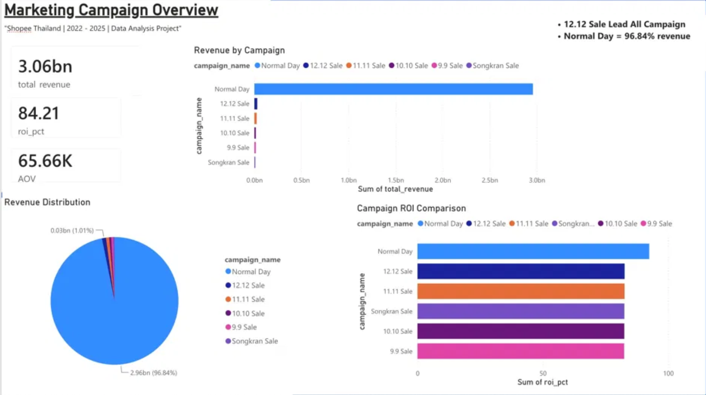
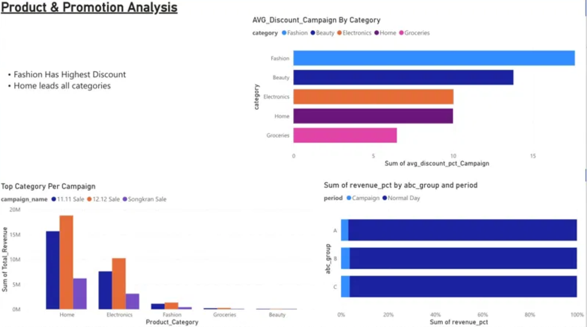
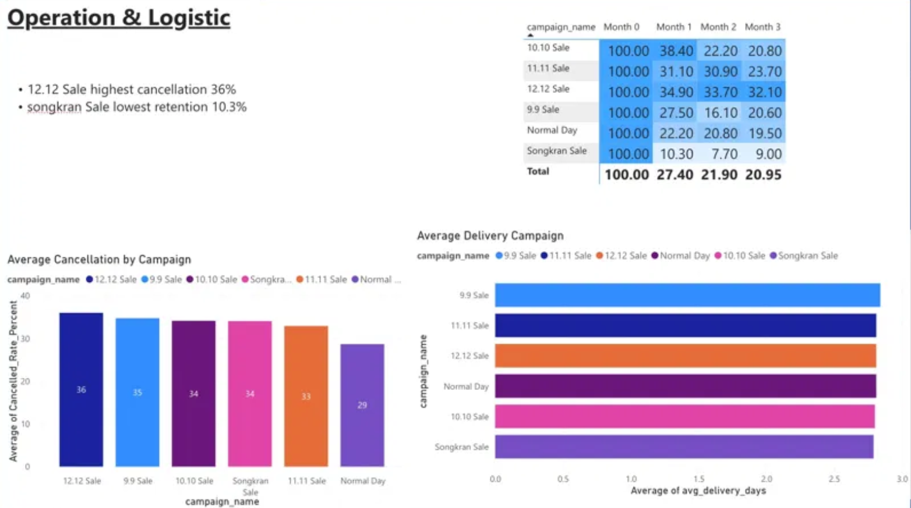

# 🛒 Shopee Thailand Campaign Analysis

## 📌 Overview
Analysis of Shopee Thailand marketing campaign performance
covering 300,000+ orders from 2022 to 2025
to answer the question "Are campaigns like 11.11 and 12.12 truly worth it?"

## 🛠️ Tools Used
- **SQL** (MySQL + DBeaver) — Data Extraction
- **Python** (Pandas, NumPy) — Advanced Analytics
- **Power BI** — Dashboard & Visualization

## 📊 Dataset
- Orders: 300,000 rows
- Order Items: 480,481 rows
- Products: 4,880 rows
- Campaigns: 20 rows

## 🔍 Key Findings & Recommendations

### 1. Normal Day dominates total revenue at 96.84%
→ Organic traffic is the main revenue driver, campaigns are supplementary

### 2. 12.12 Sale leads all campaigns with 30.78M revenue
→ Recommend increasing marketing budget for 12.12 campaign

### 3. Home category is the best seller across all campaigns
→ Recommend prioritizing Home category products in every campaign

### 4. Group A products sell by themselves without campaigns 96.96%
→ Recommend reducing discounts on Group A products to protect margins

### 5. Songkran Sale has the lowest retention rate at 10.3%
→ Recommend adding loyalty program or follow-up promotions after Songkran

### 6. 12.12 Sale has the highest cancellation rate at 36%
→ Recommend improving checkout experience and stock availability during 12.12

## 📁 Project Structure
```
shopee-thailand-campaign-analysis/
├── SQL/          ← 6 SQL Queries
├── Python/       ← Jupyter Notebook
├── Data/         ← CSV Output files
└── Dashboard/    ← Power BI Screenshots
```
## 📈 Dashboard Preview
### Marketing Overview


### Product & Promotion


### Operation & Logistic

